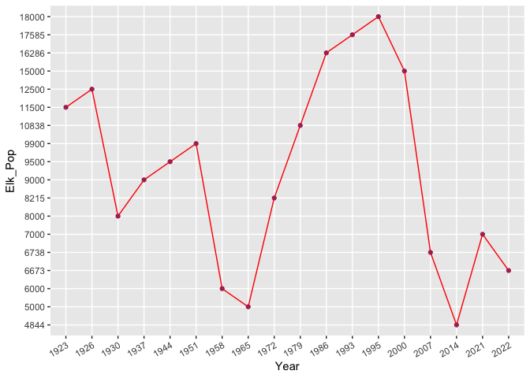
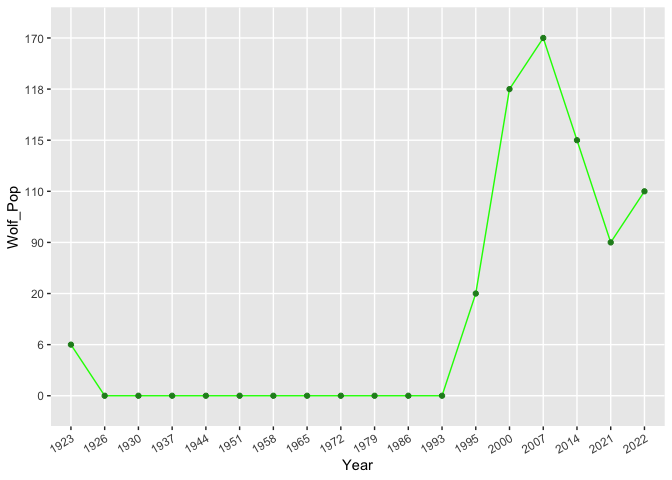

```{=html}
<div style="color:#333;background:linear-gradient(15deg, #C3FFBA, #9EFFA5);padding:10px 10px;border-radius:8px;">
<h1 style="font-family:Libre Baskerville;color:black;font-size:40px;line-height:1.3;margin-top:0px;">Elk and Wolf Populations in Yellowstone</h1>
<p style="font-height:0.3;color:#333;font-weight:500;font-size:16px;margin-bottom:5px;">Reintroduction of wolves into Yellowstone National Park and their impact on elk populations</p>
<a href="https://education.nationalgeographic.org/resource/wolves-yellowstone/" style="font-weight:600;text-decoration:none;background:#086100;color:white;margin-bottom:5px;padding:8px;display:inline-block;border-radius:8px;box-shadow:5px 5px 10px rgba(0, 0, 0, 0.6);">Click here to learn more about Elk and Wolves in Yellowstone!</a>
</div>
```


```{=html}
<div>
<p style="font-family:&quot;Helvetica Neue&quot;, Helvetica, Arial, sans-serif;">
The relationship between elk and wolves has been very complicated since the early 1800s and has gone through many ups and downs through generations of living in yellowstone. Wolves were hunted to extinction from the 1800s and the last were killed in 1926 because they were thought to be a threat to livestock and big-game populations, like elk. The reality was and still is, humans and the environment itself are the main drivers in elk population decline. The elk were overhunted and their ecosystems were drastically changed which is what caused such low numbers.
<p style="font-family:&quot;Helvetica Neue&quot;, Helvetica, Arial, sans-serif;">As I will illustrate in the following data, the population of wolves not only was not the culprit for reduction in elk populations but rather fortifies healthier populations and ecosystems in which they are included.</p>
</p>
</div>
```


## Data Analysis

This is some of the code I used to create the scatter plots from the excel sheet I created from researching each species population through various years based on information through Yellowstone National Park's website which is linked above.


``` r
df_elkwolf = read_xlsx("~/Desktop/School/Data_Analytics/Data_Course_SAPP/Data/df_elkwolf.xlsx", 
    col_types = c("numeric", "numeric", "numeric"))

df_elkwolf$Year=factor(df_elkwolf$Year)
df_elkwolf$Elk_Pop=factor(df_elkwolf$Elk_Pop)
df_elkwolf$Wolf_Pop=factor(df_elkwolf$Wolf_Pop)

df_elkwolf %>% 
  ggplot(aes(x = Year,
             y = Elk_Pop,
             group = 1)) +
             geom_line(color = 'red') +
             geom_point(color = 'maroon') +
             theme(axis.text.x = element_text(angle = 30, hjust = 1)
             )

df_elkwolf %>% 
  ggplot(aes(x = Year,
             y = Wolf_Pop,
             group = 1)) +
             geom_line(color = 'green') +
             geom_point(color = 'forestgreen') +
             theme(axis.text.x = element_text(angle = 30, hjust = 1)
             )
```



As you can see from the data above, elk populations have gone through many ups and downs in their population from the time wolves were hunted to extinction in 1926 and for 67 years to 1993. Elk populations continued to grow alongside wolves reintroduction in 1993 to about 2000. There was a significant drop in elk population in 1951 to 1965 from about 9,900 elk down to about 5,000 and then another very large drop between 1995 to 2014 where the population dropped from almost 18,000 elk to a minuscule 4,844.

A lot of individuals and agencies blamed the wolves for the massive drop in elk but if you look at the graphs and read the data, you see that elk populations had very large drops and steady growths during periods when wolves were nonexistent in Yellowstone. Further investigation revealed that the elk were dying to predation to be sure, but also to other larger factors such as drought and having to adapt their foraging behaviors. The forced change in elk behavior led to the revitalization of Yellowstone's ecosystem with improved waterways, higher biodiversity, and healthier plant life.
